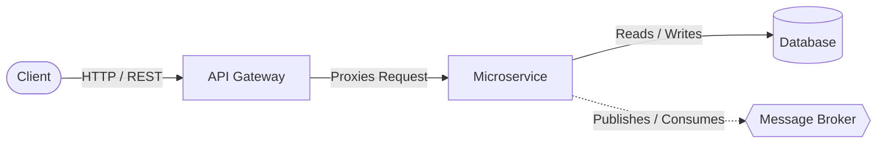

# ForgeKit

**An opinionated, production-ready microservices foundation for building scalable, maintainable, and high-quality distributed systems.**

## Overview

ForgeKit is not a simple template—it is a comprehensive, production-grade microservices foundation. It is designed to help engineering teams bootstrap complex distributed systems with enterprise-grade best practices built in from day one. 

By enforcing strict architectural boundaries and standardizing the developer workflow, ForgeKit eliminates the friction of setting up a microservices ecosystem. It focuses heavily on developer experience (DX), maintainability, and scalability, reducing the likelihood of early architectural mistakes that typically cripple distributed systems at scale.

## Why ForgeKit Exists

Building microservices is notoriously difficult. Teams often struggle with:
- **Inconsistent Structure:** Every service is built differently, making cross-team collaboration painful.
- **Poor Observability:** Tracing a request across multiple services becomes impossible without structured logging and correlation IDs.
- **Weak Testing Practices:** Coverage is treated as an afterthought, leading to fragile integrations and regression bugs.
- **Bad Architectural Decisions:** Tight coupling, shared databases, and domain leakage create a "distributed monolith."

ForgeKit solves these problems by providing a standardized, opinionated baseline. It handles the scaffolding, inter-service communication patterns, observability, and testing gates out-of-the-box, allowing developers to focus strictly on domain logic.

## Key Features

- **Opinionated Microservices Architecture:** Clear boundaries and communication patterns.
- **API Gateway + Service Structure:** Centralized entry point with downstream service routing.
- **Event-Driven Ready:** Architecture designed to support asynchronous messaging out of the gate.
- **Built-in Observability:** Structured JSON logs, correlation ID propagation, and metrics-ready hooks.
- **Standardized Service Template:** Identical layers and patterns across all services.
- **≥ 80% Test Coverage Baseline:** Quality gates enforced via CI/CD.
- **CI/CD-Ready Structure:** Predictable monorepo tooling using `pnpm` workspaces.
- **Service Scaffolding:** CLI tooling for generating new services with local auto-integration.
- **Clean Architecture Layering:** Strict separation of Transport, Application, Domain, and Infrastructure layers.

## What You Get Out of the Box

- Fully working microservices system in under 10 minutes
- API Gateway + service + database + messaging ready
- Built-in observability and correlation tracing
- CI pipeline with enforced quality gates
- Production-ready service template

## Architecture Overview

ForgeKit embraces a decoupled, scalable architecture:



- **API Gateway:** The single entry point for all external traffic. It handles request validation, initial authentication (JWT), and routes traffic to the appropriate downstream microservice.
- **Microservices:** Independently deployable units organized around business capabilities. Each service handles its own domain logic and maintains strict isolation.
- **Messaging (Event-Driven):** Services are designed to emit and consume domain events, enabling asynchronous workflows and reducing temporal coupling.
- **Database per Service:** Each microservice completely owns its data store. Direct cross-service database queries are strictly prohibited to ensure true loose coupling.

## Project Structure

ForgeKit utilizes a monorepo approach to streamline dependency management and cross-service coordination while maintaining logical independence.

- `apps/`: Contains the entry points, including the API Gateway and individual microservices.
- `packages/`: Shared libraries utilized across services (e.g., observability, tooling, testing). These packages contain zero domain logic.
- `infra/`: Infrastructure definitions, primarily Docker and Docker Compose configurations for local development.
- `scripts/`: Project utility scripts for bootstrapping the environment and scaffolding new services.
- `docs/` (and `specs/`): Technical specifications, architectural planning documents, and the project constitution.

There is absolutely **no cross-service domain coupling**. Services communicate exclusively via defined network boundaries.

## Getting Started

ForgeKit is designed to get your local environment running in minutes.

1. **Clone the repository:**
   ```bash
   git clone <repository-url>
   cd forgekit
   ```

2. **Run the bootstrap command:**
   This provisions the Docker containers, synchronizes databases, and waits for health checks.
   ```bash
   pnpm boot
   ```

3. **Access endpoints:**
   The API Gateway and services will be available locally. You can verify health via the standard health check endpoints (e.g., `http://localhost:3000/health`).

## Example Flow

A typical synchronous request flows through the system as follows:

1. **Request:** The client sends an HTTP request to the Gateway.
2. **Gateway:** Validates the auth token, generates/extracts a Correlation ID, and proxies the request to the target service.
3. **Service:** Processes the request within its Transport layer, executes Domain logic, and interacts with its dedicated Infrastructure. All structured logs generated include the propagated Correlation ID.
4. **Response:** The service returns a structured response back through the Gateway to the client.

## Service Scaffolding

Adding a new microservice is trivial using the built-in CLI:

```bash
pnpm scaffold <service-name>
```

This command generates a new service based on the standard template. The generated service comes pre-configured with:
- Standardized directory structure (Transport, Application, Domain, Infra)
- Configured logging and environment variable validation
- Initial unit and integration test setups
- Health check endpoints (`/health/liveness`, `/health/readiness`)
- Boilerplate configuration

## Development Principles

All contributions to ForgeKit adhere to a strict set of rules defined in the project Constitution:
- **Clean Code:** Readability and simplicity over cleverness.
- **Test Coverage ≥ 80%:** Non-negotiable baseline for unit and integration tests.
- **Structured Logging:** Machine-readable logs natively supporting context propagation.
- **Security by Default:** Explicit validation and least-privilege operations.
- **Separation of Concerns:** Business logic is fully isolated from external frameworks and I/O.
- **No Shared Domain Coupling:** Services do not share database tables or internal data structures.

## Observability and Reliability

Production systems require absolute visibility. ForgeKit includes:
- **Correlation ID Propagation:** Every request is uniquely tagged, allowing tracing across service boundaries.
- **Structured Logs:** Consistent, queryable log formats across all applications and shared packages.
- **Readiness and Liveness Checks:** Built-in Kubernetes-compatible health endpoints for safe deployments and traffic routing.
- **Metrics Support:** Extensible hooks prepared for metrics integration.

## Authentication (Development Baseline)

ForgeKit includes a lightweight, JWT-based development authentication mechanism to facilitate secure testing locally:
- The Gateway acts as the authentication terminator. It validates incoming JWTs.
- Downstream services do not validate tokens directly; they rely on identity context propagated securely via headers by the Gateway.

## Roadmap

Future enhancements planned for the ForgeKit foundation:
- Addition of reference services demonstrating complex domain boundaries.
- Distributed tracing improvements.
- Advanced messaging patterns.
- Production-grade deployment examples.

## Contribution

Contributions are welcome but must strictly adhere to the project standards. Before contributing, please review the project constitution and the existing specifications to ensure alignment with our architectural principles. Quality gates are enforced automatically.

---

**ForgeKit** reflects real-world engineering practices used in high-scale distributed systems and is designed to serve both as a production foundation and a reference for building systems the right way.